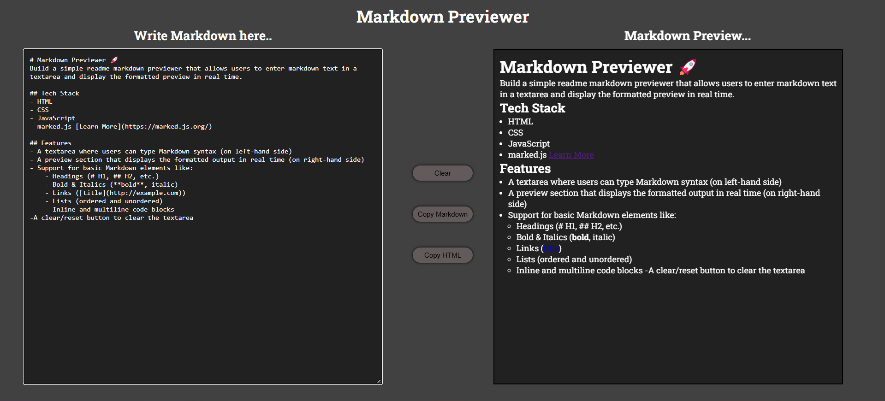

# Markdown Previewer 🚀
Build a simple readme markdown previewer that allows users to enter markdown text in a textarea and display the formatted preview in real time.

## Tech Stack
- HTML
- CSS
- JavaScript
- marked.js [Learn More](https://marked.js.org/)

## Features
- A textarea where users can type Markdown syntax (on left-hand side)
- A preview section that displays the formatted output in real time (on right-hand side)
- Support for basic Markdown elements like:
    - Headings (# H1, ## H2, etc.)
    - Bold & Italics (**bold**, italic)
    - Links ([title](http://example.com))
    - Lists (ordered and unordered)
    - Inline and multiline code blocks
-A clear/reset button to clear the textarea

## Screenshots

## Deployment link
[Live Demo](https://markdown-previewer-eight-psi.vercel.app/)

[GitHub Repo](https://github.com/Ganesh-Ghadage/markdown-previewer)