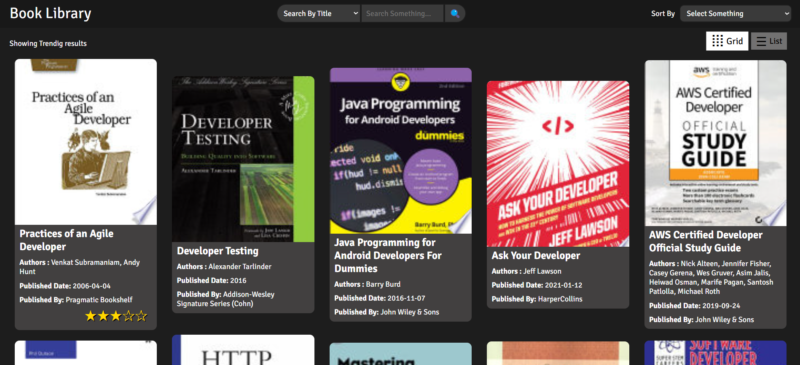
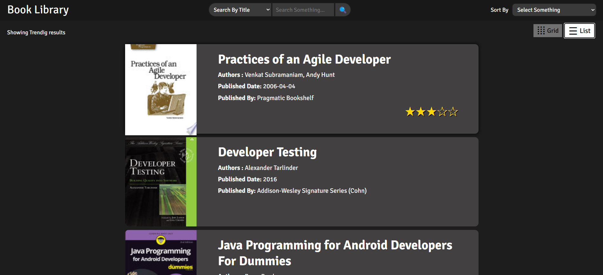
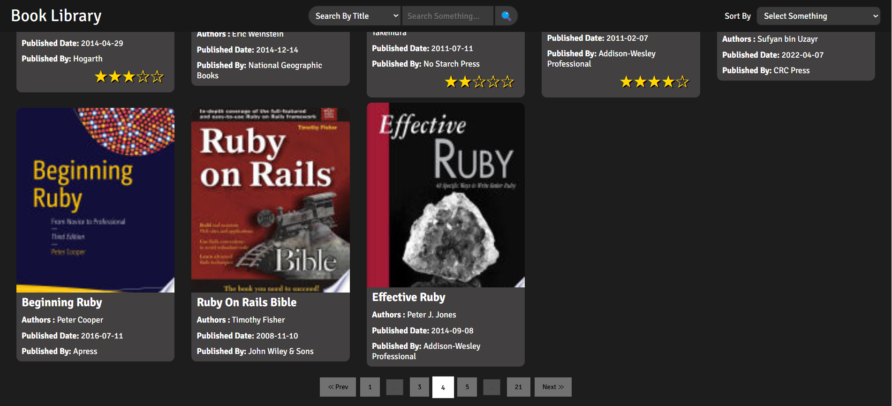
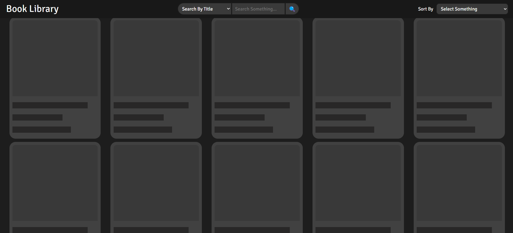
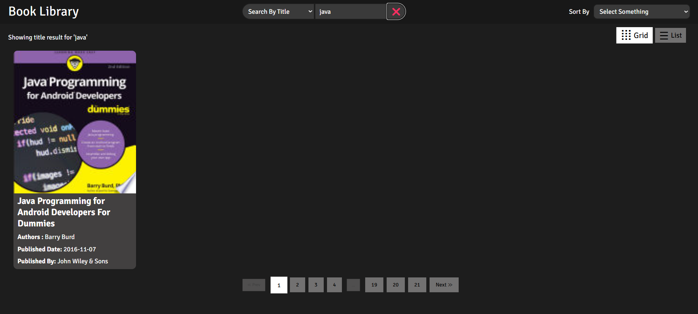
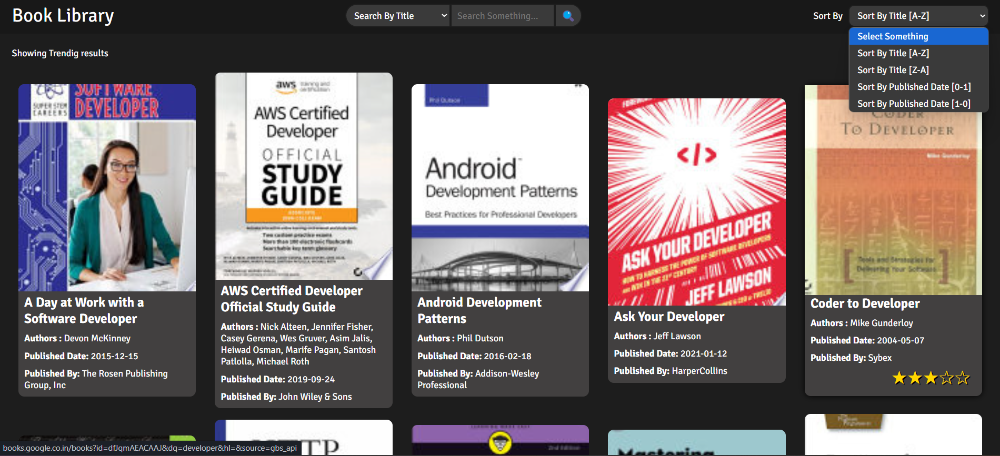

# Books Library

A Book Library website using FreeAPI.app that will fetch and display book data dynamically in a user-friendly way.

## Tech Stack
 - HTML
 - CSS
 - JavaScript

## Features
- Display the books in a list/grid layout.
- Book details contains title, author, publisher, published date, and thumbnail.
- A search bar to filter books by title or author
- A sort feature to list books in Alphabetical order based on their title, date of release (publishedDate)
- Pagination at the end of the page to call next set of details
- Lear more about the book by clicking on it to open more details in a new tab

## Screenshots

Grid Layout

List Layout

Pagination 

Loading skeleton

Search filter

Sort Options

## Deployments

[Live Demo](https://books-library-beta.vercel.app/)

[GitHub Repo](https://github.com/Ganesh-Ghadage/Books-Library)