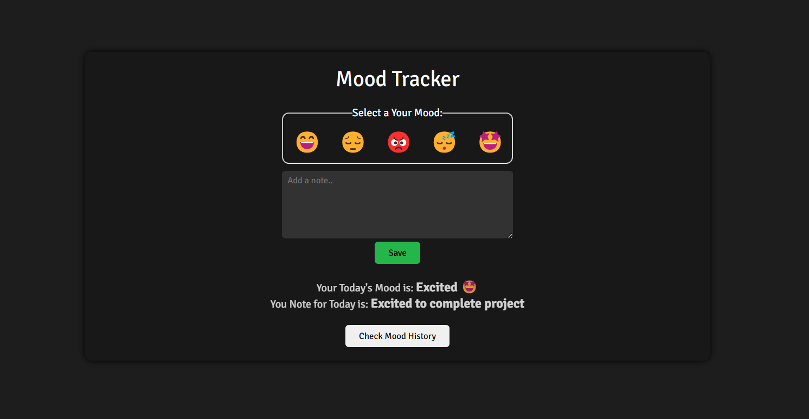
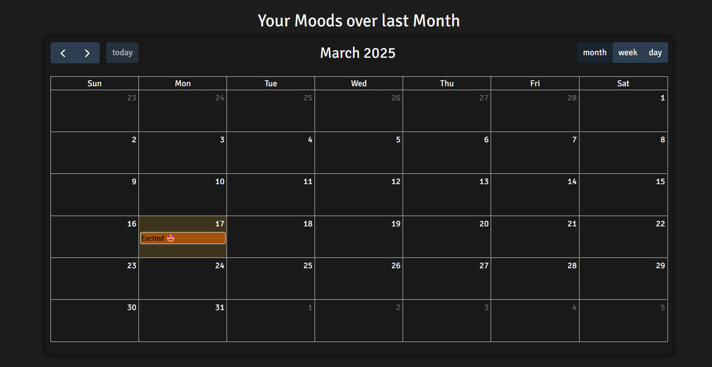

# Mood Tracker
Your daily mood tracker

## Tech Stack
- HTML
- CSS
- JavaScript
- FullCalander - Library for calender support [[Learn More](https://fullcalendar.io/)]

## Application features
- Emoji based mood selection
- Add note for daily mood
- Track daily/weekly/monthly moods
- Calender support for timeline view
- Responsive Design
- LocalStorage to store mood logs

## Screenshots

## Deployment link

[Live Demo](https://mood-tracker-pearl.vercel.app/)

[GitHub Repo](https://github.com/Ganesh-Ghadage/web-dev-cohort/tree/main/masterJiAssignments/MoodTracker)