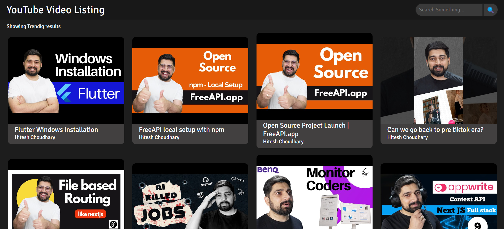
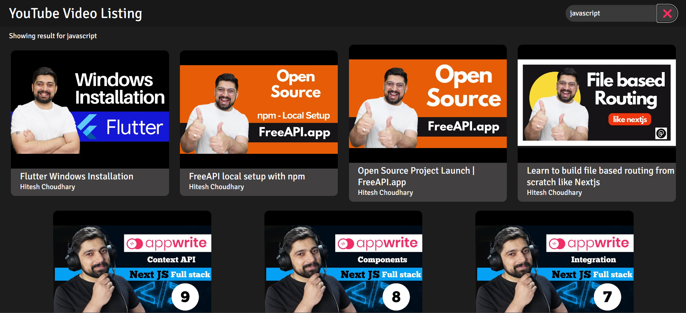
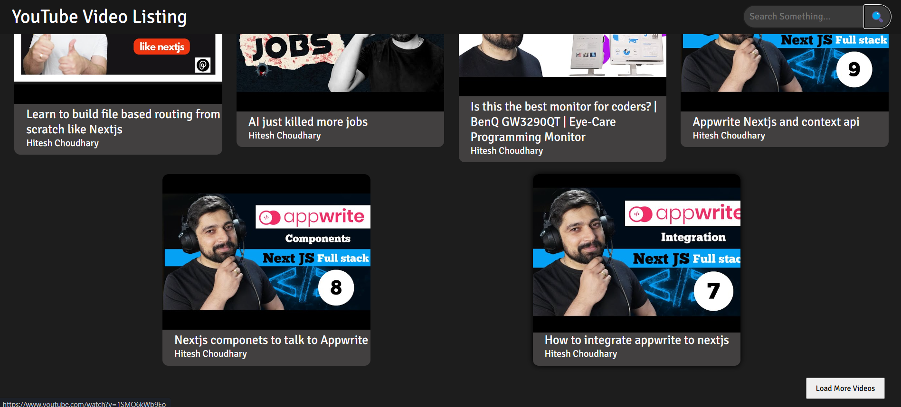

# YouTube Video Listing
YouTube-style video listing page

## Tech Stack
- HTML
- CSS
- JavaScript
- FreeApi - for fetching Youtube Video Data [[Learn More](https://freeapi.hashnode.space/api-guide/apireference/getYoutubeVideos)]

## Application features
- YouTube-style video listing page
- Shows video thumbnails, titles, and channel names
- Opens a video in Youtubbe by clicking on it
- A search bar to filter videos based on tags (filteration is done on frontend without any additional api calls)
- Implemented a grid layout for better UI
- Load More button to load additional videos
- responsive design

## Screenshots

## Deployment link

[Live Demo](https://youtube-video-listing.vercel.app/)

[GitHub Repo](https://github.com/Ganesh-Ghadage/YouTube-Video-Listing)